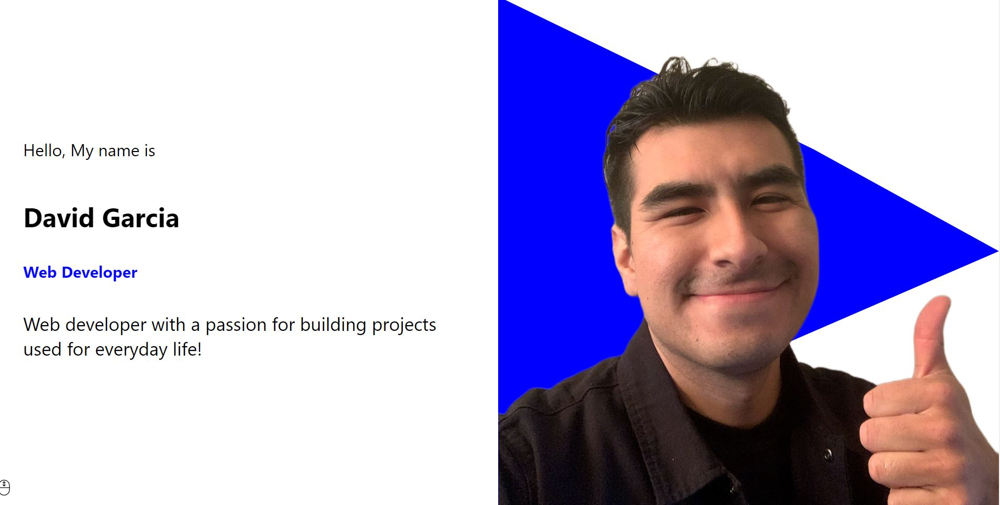

# Updated-React-Portfolio

## Table of Contents: 
-[Descripition](#Description)
    -[Instalation](#Instalation)
    -[Usage](#Usage)
    -[License](#License)
    -[Contributions](#Contributions)
    -[Tests](#Tests)
    -[Questions](#Questions)
    -[GitHub](#GitHub)
    -[Email](#Email)
    
##  Description
This is a portfolio made with React.js. This project showcases a photo of myself, a small description of my work and my certification. Towards the end of the page  you will find my projects with links and a contact email form to reach out .

## Instalation
The user can clone the repo and type npm i in the terminal to download all packages.

## Usage
This application is used for others to view my current work along with a way to contact myself.

## License
None

## Contributions
David Garcia

## Tests
N/A

## Questions
If there are any questions regarding this application please reach out to me.

## GitHub 
https://github.com/rednblue97

## Email
probablydavidgarcia97@gmail.com
